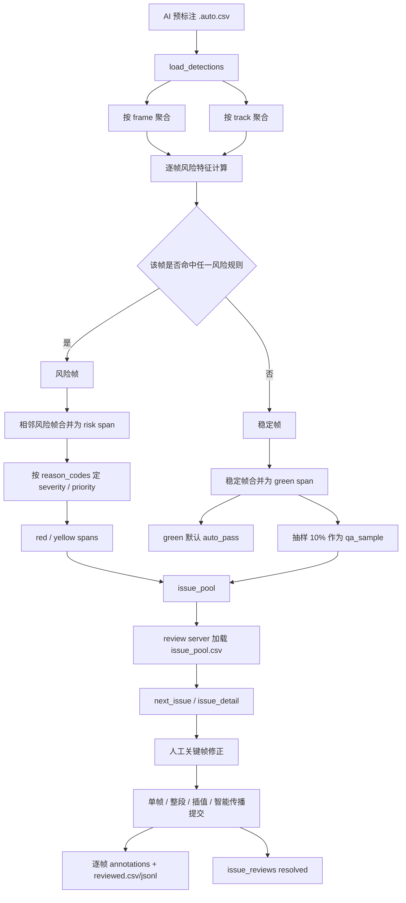
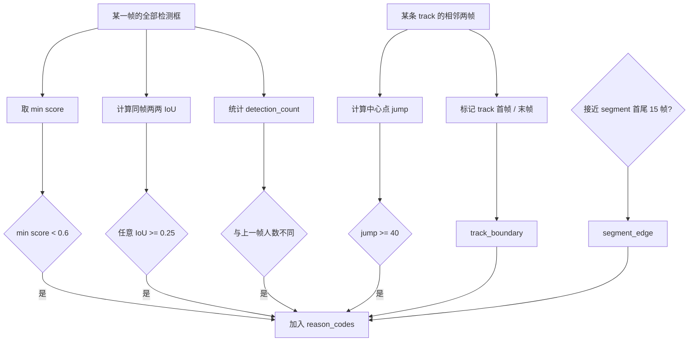
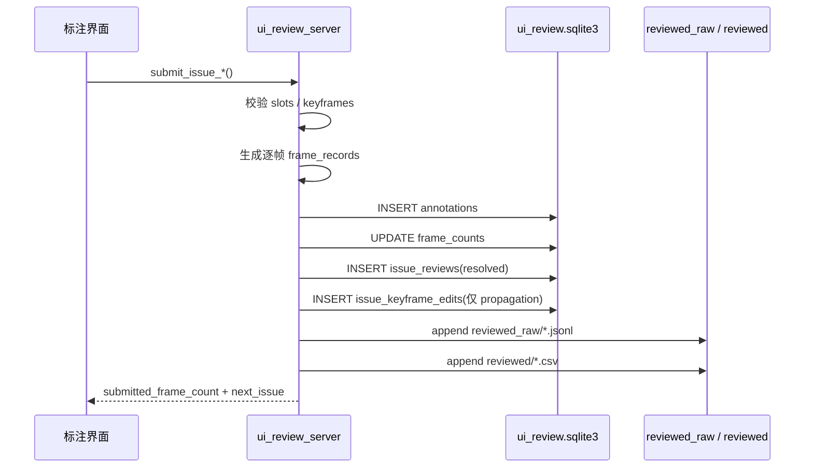
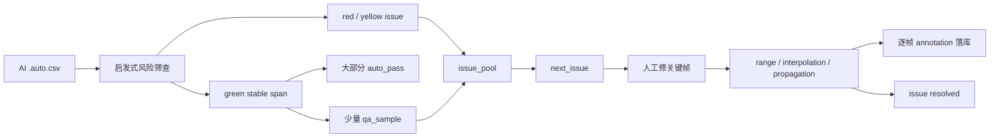

# Issue / 轨迹级 Review 流程说明

本文档解释当前仓库里 “issue-mode / 轨迹级 review” 的**实际实现**，重点回答：

1. 什么是 `issue`
2. `issue` 是怎么从 AI 预标注里算出来的
3. 什么情况下会被当成“非 issue”
4. 标注员处理一个 `issue` 之后，系统里到底发生了什么
5. 当前方案有哪些风险、在哪些情况下会出问题

本文档对应的是**当前代码**，不是理想规划稿。主要实现位置：

- [codes/process_review_issue_prep.py](/home/hrli/data_annotation/codes/process_review_issue_prep.py)
- [codes/ui_review_server.py](/home/hrli/data_annotation/codes/ui_review_server.py)
- [codes/review_propagation.py](/home/hrli/data_annotation/codes/review_propagation.py)
- [docs/REQUIREMENTS_TRAJECTORY_REVIEW.md](/home/hrli/data_annotation/docs/REQUIREMENTS_TRAJECTORY_REVIEW.md)

---

## 1. 一句话概括

当前这套 `issue` 机制，本质上不是“自动判定哪里错了”，而是：

- 先用启发式规则从 AI 结果里找出**高风险帧**
- 再把相邻高风险帧合并成**风险区间**
- 把这些风险区间变成 `issue`
- 让标注员只处理这些 `issue`
- 对明显稳定的区间默认 `auto_pass`
- 对稳定区间抽一小部分做 `qa_sample`

所以它更像一个：

- **review 路由器**

而不是：

- **正确性证明器**

---

## 2. 整体流程图

---

## 3. 离线阶段：如何确定 `issue`

### 3.1 输入是什么

离线脚本 [`process_review_issue_prep.py`](/home/hrli/data_annotation/codes/process_review_issue_prep.py) 会读取：

- `manifests/annotation_tasks.csv`
- `pseudo_labels/<video_stem>.auto.csv`

每一条 AI 检测记录会被读成一个 `Detection`，只保留：

- `bbox_w > 0`
- `bbox_h > 0`

也就是说，当前离线分析只看**有框的 AI 检测结果**。

### 3.2 先生成两个基础视图

脚本会同时生成两个聚合视图：

- `group_by_frame(detections)`
  - 方便看同一帧里有多少框、框和框之间是否重叠、人数是否变化
- `group_by_track(detections)`
  - 方便看同一条 `track_id` 的首尾、jump、低分次数

同时会额外生成一个 `track_summary.json`，里面是每条轨迹的摘要：

- `start_frame / end_frame`
- `avg_score / min_score`
- `max_jump_distance`
- `low_score_count`
- `max_frame_gap`

这份摘要主要给前端 “轨迹工作台” 用，不直接决定 issue。

---

## 4. 逐帧风险规则：一帧为什么会变成风险帧

当前所有阈值都是**固定启发式常数**：

| 规则 | 含义 | 当前阈值 | 代码位置 |
| --- | --- | --- | --- |
| `low_score` | 当前帧里最差框分数太低 | `< 0.6` | `LOW_SCORE_THRESHOLD` |
| `high_overlap` | 同帧两框重叠太高 | `IoU >= 0.25` | `HIGH_OVERLAP_IOU` |
| `bbox_jump` | 同一 track 相邻出现时位移过大 | `jump >= 40 px` | `LARGE_JUMP_DISTANCE` |
| `count_change` | 当前帧人数与上一帧不同 | 无阈值 | 直接比较 |
| `track_boundary` | 一条轨迹的首帧或末帧 | 无阈值 | 直接标记 |
| `segment_edge` | 靠近 session 开头或结尾 | `15` 帧内 | `SEGMENT_EDGE_FRAMES` |

流程图如下：

只要某帧命中任意一条规则，这一帧就会被认定为“风险帧”。

---

## 5. 风险帧如何合并成 `issue`

风险帧不会一帧一条派单，而是先合并成 span。

### 5.1 合并规则

如果相邻两个风险帧之间的间隔：

- `<= 2 帧`

就会被并到同一个风险区间里。

这由 `SPAN_MERGE_GAP = 2` 控制。

### 5.2 span 上会汇总哪些信息

每个 span 会聚合：

- `start_frame / end_frame`
- `start_timestamp_ms / end_timestamp_ms`
- `frame_count`
- `reason_codes`
- `primary_track_ids`
- `min_score`
- `max_overlap_iou`
- `max_jump_distance`
- `imu_count`

所以一个 `issue` 不是“某一帧哪里有问题”，而是：

- **某个时间段**
- **为什么值得看**
- **主要涉及哪些轨迹**

### 5.3 severity 怎么定

当前 severity 只有 3 档：

- `red`
- `yellow`
- `green`

对风险 span 而言：

- 只要 `reason_codes` 里包含任意一个：
  - `low_score`
  - `high_overlap`
  - `bbox_jump`
- 就定为 `red`

否则就是 `yellow`。

也就是说：

- `count_change`
- `track_boundary`
- `segment_edge`

单独出现时，只会产生 `yellow`，不会升成 `red`。

### 5.4 priority 怎么定

priority 不是模型输出，是规则加权：

- `low_score / high_overlap / bbox_jump`：各加 `4`
- `count_change`：加 `2`
- `track_boundary / segment_edge`：各加 `1`
- 另外再叠加：
  - `max(0, 0.6 - min_score) * 5`
  - `max_overlap_iou * 3`
  - `max_jump_distance / 25`

最后按 `priority_score` 降序排序，越靠前越优先派给人工。

---

## 6. 如何确定“非 issue”

这里要非常注意：

- “非 issue” 不等于“被证明没问题”
- 它只等于“没命中当前这几条风险规则”

### 6.1 绿色稳定段的定义

如果某一帧：

- 存在 AI 检测框
- 但没有命中任何 `reason_codes`

那它会进入稳定帧集合。

这些稳定帧会被合并成连续的 `green span`，并带上：

- `severity = green`
- `review_policy = auto_pass`
- `reason_codes = ["stable_segment"]`

### 6.2 green 不会全部进入人工 review

green span 会分成两类：

- 大多数：
  - `review_policy = auto_pass`
  - 不进入 `issue_pool`
- 少量抽样：
  - `review_policy = qa_sample`
  - 会进入 `issue_pool`

当前抽样比例是：

- `GREEN_QA_SAMPLE_RATE = 0.1`

即大约 `10%` 的 green span 被抽出来做人审 QA。

### 6.3 当前“非 issue”的严格含义

所以今天系统里的“非 issue”更准确地说是：

- **不进入人工主 review 池的 green auto-pass span**

而不是：

- **已经被证明正确的 span**

---

## 7. issue_pool 到 review 服务：在线派单怎么工作

离线阶段会产出：

- `<video_stem>.track_summary.json`
- `<video_stem>.risk_spans.json`
- `<video_stem>.issue_pool.csv`
- `review_prep_summary.json`

其中真正给 review 服务用的是：

- `issue_pool.csv`

review server 启动时会加载全部 `*.issue_pool.csv` 到内存，形成：

- `issue_pool`
- `issue_lookup`

### 7.1 派单逻辑

当前 `POST /api/next_issue` 的逻辑很简单：

1. 取出所有未 resolved 的 issue
2. 用一个全局索引 `_issue_dispatch_index`
3. 按顺序轮转返回下一条

也就是说，当前并不是：

- 真正按 annotator 做锁定派单

而是：

- 一个“全局 unresolved 队列 + 轮转选择”

### 7.2 一个 issue 返回给前端时包含什么

`issue_detail` / `next_issue` 返回的 payload 里会有：

- issue 元数据
- 当前 focus frame
- 当前帧上的 AI boxes
- `slot_names`
- `issue_tracks`

`issue_tracks` 来自 `track_summary.json`，主要是给前端“轨迹工作台”显示：

- 轨迹可见范围
- 平均分 / 最低分
- 最大 jump
- 当前 focus frame 是否落在这条轨迹可见区间内

---

## 8. 标注员处理一个 issue 之后，会产生什么影响

### 8.1 总体结构

在线提交之后，系统会同时改三类东西：

1. 写入逐帧 annotation 记录
2. 更新 issue 完成态
3. 在某些模式下写入关键帧编辑记录

### 8.2 提交方式总览

| 接口 | 作用 | 是否写逐帧 annotations | 是否标记 issue resolved |
| --- | --- | --- | --- |
| `submit_issue` | 只提当前帧 | 是 | 是 |
| `submit_issue_range` | 当前槽位决策扩到整个 issue | 是 | 是 |
| `submit_issue_partial_range` | 扩到 issue 子区间 | 是 | 只有覆盖全 issue 才是 |
| `submit_issue_interpolation` | 两关键帧之间线性插值 | 是 | 只有覆盖全 issue 才是 |
| `submit_issue_propagation` | 多关键帧 + AI 轨迹跟随传播 | 是 | 只有覆盖全 issue 才是 |

### 8.3 数据落地流程

### 8.4 逐帧 annotation 会写到哪里

提交后最终会落到：

- SQLite `annotations`
- SQLite `frame_counts`
- `reviewed_raw/<video_stem>.frame_records.jsonl`
- `reviewed/<video_stem>.reviewed.csv`

换句话说：

- 虽然前台是按 issue / 关键帧在工作
- 后台最终还是会被展开回**逐帧记录**

### 8.5 issue completed 之后的行为

如果一个 issue 被写入 `issue_reviews`：

- 它就会从 `next_issue`
- 和 `GET /api/issues`

里消失，因为 server 会过滤 resolved ids。

但它并没有从内存里删除，所以：

- 只要你知道 `issue_id`
- 仍然可以用 `issue_detail` 直接打开它

### 8.6 propagation 会额外写什么

`submit_issue_propagation` 会把用户记录的关键帧，额外写到：

- `issue_keyframe_edits`

这张表现在的作用主要是：

- 留下关键帧编辑痕迹

真正导出仍然依赖展开后的逐帧 annotations。

---

## 9. 智能传播是怎么做的

传播不是纯线性插值，而是：

- **关键帧修正 + 沿 AI 轨迹跟随**

### 9.1 单关键帧传播

如果一个槽位只给了一个关键帧：

- 若这个关键帧绑定了 `ai_track_id`
- 并且后续帧还能找到同一条 AI track
- 就会把关键帧相对 AI 框的偏移量 `dx/dy/dw/dh` 复制到后续帧

也就是：

- `人工框 = 当前帧 AI 框 + 关键帧修正偏移`

### 9.2 双关键帧传播

如果一个槽位有两个关键帧：

- 如果起止关键帧都可见，优先做“修正量插值”
- 如果两端是同一条 AI track，就基本沿同一轨迹传播
- 如果两端是不同 AI track，会在中点附近做轨迹切换

### 9.3 状态型关键帧

对于：

- `absent`
- `occluded`
- `outside`

这种状态，不会做 bbox 插值，而是直接把状态向区间内复制。

所以这套传播更像：

- “以 AI 为骨架、以关键帧修正为偏移、用状态型关键帧控制可见性”

而不是：

- 完全脱离 AI 的轨迹重建器

---

## 10. 为什么会有 green / auto-pass / qa-sample

这是当前方案里最重要的“节省人工”部分。

目标不是让所有东西都人工看，而是：

- 红段重点看
- 黄段看关键点
- 绿段默认放过
- 从绿段里抽样做 QA

当前 batch 的 summary 里能直接看到：

- `severity_counts`
- `auto_pass_span_count`
- `qa_sample_span_count`

admin 页面现在已经把这几个数展示出来了。

---

## 11. 这一套方案当前最容易出问题的地方

这一节讲的是**真实风险**，不是理论上的“以后可以优化”。

### 11.1 稳定但持续错误的 AI，会被误判为 green

如果 AI：

- 一整段都稳定地偏一点
- 稳定地把人框得过小
- 稳定地把同一个人框偏左/偏右

它可能完全不触发：

- `low_score`
- `high_overlap`
- `bbox_jump`
- `count_change`

于是这一整段会被当成：

- `green auto_pass`

这说明当前 green 的含义只是：

- “没触发启发式异常”

不是：

- “它一定是对的”

### 11.2 AI 完全漏检的帧，有盲区

离线逻辑是从 `detections` 出发的。

如果某一帧：

- AI 完全没框

它不会天然进入 “绿色稳定帧” 主路径，也不会像“有框低分”那样自然被描述。

所以“彻底漏人”这类情况，当前风险表达能力还不够强。

### 11.3 `submit_issue` 只提一帧，也会把整个 issue 标记完成

这是当前交互里最危险的一点。

在 issue-mode 下，如果调用的是：

- `submit_issue`

那它只写当前帧 annotation，但会直接：

- `mark_issue_resolved(..., "issue")`

所以一个本来是多帧 issue 的问题，可能因为“只修了当前帧”就被关掉。

### 11.4 当前没有真正的 issue 锁

`next_issue` 目前不按 annotator 做加锁派单。

结果是：

- 两个人可能拿到同一个 unresolved issue
- 重复劳动
- 先提交的人会把 issue resolve 掉
- 后提交的人会觉得自己“修了一个已经完成的 issue”

### 11.5 `issue_id` 不是稳定主键

当前 `issue_id` 是按排序后重新编号得到的：

- `video_stem_issue_001`
- `video_stem_issue_002`

如果你：

- 调整阈值
- 调整 green 抽样比例
- 重新跑 `review_prep`

span 排序一变，`issue_id` 就可能整体漂移。

但 resolved 状态又是按 `issue_id` 存的。

这会带来两个风险：

- 旧 resolved 状态对不上新 issue
- 或者误把新 issue 当成旧 issue 已完成

### 11.6 传播高度依赖 AI 轨迹质量

现在 propagation 的思想是：

- “AI 轨迹 + 关键帧修正偏移”

如果 AI 本身发生：

- ID switch
- 漂移
- 中间突然消失
- 框跳错目标

传播会把这个错误更高效地扩到更多帧。

### 11.7 `split / merge / reappear` 还只是 issue 内、槽位级操作

目前这些操作最后仍然落成：

- 逐帧 slot 记录

而不是一个全局一致的轨迹图。

所以在：

- 跨 issue 的长轨迹整理
- 多条轨迹重组
- 真正的全局 ID 管理

上，还不是终态方案。

### 11.8 IMU 现在主要只是提示，没有真正进入 issue 判定主逻辑

当前离线 issue 算法里，IMU 只是元数据：

- `imu_count`

现在前端只会在 `count_change / track_boundary` 等冲突类 issue 上，显示轻量提示。

但 IMU 还没有真正作为：

- 风险规则
- 身份冲突裁决信号

参与主判定。

所以如果出现：

- 视觉上稳定
- 但人数 / 身份和 IMU 明显冲突

当前 issue 机制未必能主动抓出来。

---

## 12. 如何正确理解当前方案

把它理解成下面这句话最合适：

> 当前系统擅长“把明显值得看的地方优先交给人”，但不擅长“证明剩下的地方一定没问题”。

因此它的正确定位应该是：

- 高 ROI 的 review 派单与传播工作流

而不是：

- 自动 correctness guarantee 系统

---

## 13. 给标注员的实用心智模型

如果你是面对 review 界面的使用者，可以把一个 `issue` 理解成：

- “这是一小段时间区间”
- “系统觉得它比别的地方更容易出错”
- “你不需要逐帧看，只要修关键帧”
- “修完后用传播把结果扩回整段”

也就是说，默认工作单位已经从：

- 一帧

变成：

- 一段问题轨迹

---

## 14. 当前流程的简化版

---

## 15. 后续如果要继续增强，最值得补的点

按优先级，我认为最值得继续补的是：

1. 为 `issue` 增加真正的分配锁，避免多标注员重复拿同一条
2. 让 `submit_issue` 不再默认一帧提交就 resolve 整个 issue
3. 让 `issue_id` 变成稳定主键，而不是排序编号
4. 把“完全漏检 / 长时间无框”纳入 issue 规则
5. 把 IMU 冲突真正纳入风险规则，而不只是前端提示
6. 把 propagation 从“跟随 AI 偏移”进一步升级为更鲁棒的轨迹编辑模型

---

## 16. 相关文档

- [REQUIREMENTS_TRAJECTORY_REVIEW.md](/home/hrli/data_annotation/docs/REQUIREMENTS_TRAJECTORY_REVIEW.md)
- [ANNOTATOR_INTRO.md](/home/hrli/data_annotation/docs/ANNOTATOR_INTRO.md)
- [REQUIREMENTS_UI_REVIEW.md](/home/hrli/data_annotation/docs/REQUIREMENTS_UI_REVIEW.md)

