# Data Annotation Pipeline

本仓库当前是一套围绕 **两阶段标注主线** 组织的代码仓库。

主线口径是：

- `Step 0` 原始采集整理（可选）
- `Step 1` AI 预标注
- `Step 2` 第一阶段任务生成
- `Step 3` 第一阶段人工粗标
- `Step 4` 第二阶段任务池生成
- `Step 5` 第二阶段精细化标注 / review

其中当前真正已经跑通的主线重点是：

- `Step 0 -> Step 3`

当前统一代码目录是：

- `./codes/`
- 当前代码分区说明见：
  - [codes/README.md](/home/hrli/data_annotation/codes/README.md)

当前正式 batch 基线是：

- `./annotation/batch_20260413_v01`
- 当前推荐用于试运行最新 `human_stage_1` 行为与降本策略的派生 batch：
  - `./annotation/batch_20260417_v01`
  - 当前 `human_stage_1` 优化报告见：
    - [BATCH_20260417_V01_HUMAN_STAGE_1_SEGMENTATION_OPTIMIZATION_REPORT.md](/home/hrli/data_annotation/docs/BATCH_20260417_V01_HUMAN_STAGE_1_SEGMENTATION_OPTIMIZATION_REPORT.md)

---

## 当前状态

截至当前版本，主线能力如下：

1. A 阶段：预标注批处理可从 `data/required/` 生成 `pseudo_labels/*.auto.csv`
2. `Step 1` 已稳定：
   - `codes/process/step1_prelabel/process_prelabel_batch.py`
   - `pseudo_labels/*.auto.csv`
3. `Step 2` 已稳定：
   - `codes/process/step2_stage1_prep/process_human_stage_1_prep.py`
   - `annotation/batch_*/human_stage_1_prep/`
4. `Step 3` 已稳定：
   - `codes/application/step3_human_stage_1/ui_human_stage_1_server.py`
   - `codes/application/step3_human_stage_1/web/`
5. `Step 3` 当前已落地的交互包括：
   - first-pass 之后的 second-pass `repair_window` 合并
   - 单帧 coarse decision：`ai_match / absent / needs_manual`
   - 同视频历史多数票推荐与自动预选
   - 批量“其余设为不存在”
   - 左侧可折叠历史栏与已提交记录修改
6. `Step 4` 目录已显式保留，但当前生产实现仍未独立落地
7. `Step 5` 资源已整理到：
   - `codes/process/step5_stage2_review_prep/`
   - `codes/application/step5_stage2_review/`
   但按主线口径仍视为后续阶段

当前事实文档请优先看：

- [DOCUMENTATION_STATUS.md](/home/hrli/data_annotation/docs/DOCUMENTATION_STATUS.md)
- [REQUIREMENTS_SEGMENT_REVIEW.md](/home/hrli/data_annotation/docs/REQUIREMENTS_SEGMENT_REVIEW.md)
- [STABLE_SEGMENT_MATHEMATICAL_DEFINITIONS.md](/home/hrli/data_annotation/docs/STABLE_SEGMENT_MATHEMATICAL_DEFINITIONS.md)
- [REQUIREMENTS_UI_REVIEW.md](/home/hrli/data_annotation/docs/REQUIREMENTS_UI_REVIEW.md)
- [BATCH_20260417_V01_HUMAN_STAGE_1_SEGMENTATION_OPTIMIZATION_REPORT.md](/home/hrli/data_annotation/docs/BATCH_20260417_V01_HUMAN_STAGE_1_SEGMENTATION_OPTIMIZATION_REPORT.md)

历史与已归档文档入口见：

- [archive/README.md](/home/hrli/data_annotation/docs/archive/README.md)

---

## 核心目录

```text
.
├── codes/
│   ├── application/
│   ├── process/
│   ├── test/
│   └── archive/
├── docs/
├── data/
├── annotation/
│   └── batch_<YYYYMMDD>_<vNN>/
└── staging/
```

---

## 先看哪几份文档

如果你是第一次接手，推荐顺序：

1. [README.md](/home/hrli/data_annotation/docs/README.md)
2. [DOCUMENTATION_STATUS.md](/home/hrli/data_annotation/docs/DOCUMENTATION_STATUS.md)
3. [REQUIREMENTS_SEGMENT_REVIEW.md](/home/hrli/data_annotation/docs/REQUIREMENTS_SEGMENT_REVIEW.md)
4. [STABLE_SEGMENT_MATHEMATICAL_DEFINITIONS.md](/home/hrli/data_annotation/docs/STABLE_SEGMENT_MATHEMATICAL_DEFINITIONS.md)
5. [REQUIREMENTS_UI_REVIEW.md](/home/hrli/data_annotation/docs/REQUIREMENTS_UI_REVIEW.md)
6. [ANNOTATOR_INTRO.md](/home/hrli/data_annotation/docs/ANNOTATOR_INTRO.md)
7. [BATCH_20260417_V01_HUMAN_STAGE_1_SEGMENTATION_OPTIMIZATION_REPORT.md](/home/hrli/data_annotation/docs/BATCH_20260417_V01_HUMAN_STAGE_1_SEGMENTATION_OPTIMIZATION_REPORT.md)
8. [REQUIREMENTS_PRELABEL.md](/home/hrli/data_annotation/docs/REQUIREMENTS_PRELABEL.md)
9. [codes/README.md](/home/hrli/data_annotation/codes/README.md)
10. [codes/process/README.md](/home/hrli/data_annotation/codes/process/README.md)

如果你只关心 review 标注界面怎么用：

1. [ANNOTATOR_INTRO.md](/home/hrli/data_annotation/docs/ANNOTATOR_INTRO.md)
2. [REQUIREMENTS_SEGMENT_REVIEW.md](/home/hrli/data_annotation/docs/REQUIREMENTS_SEGMENT_REVIEW.md)

如果你只关心 `human_stage_1` 当前优化方向：

1. [BATCH_20260417_V01_HUMAN_STAGE_1_SEGMENTATION_OPTIMIZATION_REPORT.md](/home/hrli/data_annotation/docs/BATCH_20260417_V01_HUMAN_STAGE_1_SEGMENTATION_OPTIMIZATION_REPORT.md)
2. [codes/process/README.md](/home/hrli/data_annotation/codes/process/README.md)

---

## 当前主线流程

```mermaid
flowchart LR
    A[data/required] --> B[process/step1_prelabel/process_prelabel_batch.py]
    B --> C[batch/pseudo_labels/*.auto.csv]
    C --> D2[process/step2_stage1_prep/process_human_stage_1_prep.py]
    D2 --> E2[batch/human_stage_1_prep]
    E2 --> F2[application/step3_human_stage_1/ui_human_stage_1_server.py]
    F2 --> G2[human_stage_1 UI]
    G2 --> H2[human_stage_1/coarse_labels_raw]
    H2 --> J[step4 stage-two task-pool generation]
    J --> K[step5 stage-two review and refinement]
```



### 这条主线里每一步的角色

- `Step 0`
  - `process/step0_preprocess/`
  - 负责把原始采集整理成标准输入
- `Step 1`
  - `process/step1_prelabel/process_prelabel_batch.py`
  - 负责 AI 预标注
- `Step 2`
  - `process/step2_stage1_prep/process_human_stage_1_prep.py`
  - 负责生成第一阶段任务
- `Step 3`
  - `application/step3_human_stage_1/`
  - 负责第一阶段人工粗标
- `Step 4`
  - `process/step4_stage2_task_pool/`
  - 当前是显式保留的主线缺口
- `Step 5`
  - `process/step5_stage2_review_prep/`
  - `application/step5_stage2_review/`
  - 当前保留基础设施，但按主线口径属于后续阶段
- `Support`
  - `application/support/ui_admin_server.py`
  - 负责管理面板

---

## 常用命令

### 1. 运行离线 human_stage_1 prep

```bash
cd /home/hrli/data_annotation
PYTHONPATH=codes .venv/bin/python codes/process/step2_stage1_prep/process_human_stage_1_prep.py \
  --batch-dir ./annotation/batch_20260417_v01
```

### 2. 启动 human_stage_1 服务

下面的 `10086` 是当前仓库常用的本地映射端口，不是 `step3_human_stage_1/ui_human_stage_1_server.py` 里的 argparse 默认端口。

```bash
cd /home/hrli/data_annotation
PYTHONPATH=codes .venv/bin/python codes/application/step3_human_stage_1/ui_human_stage_1_server.py \
  --batch-dir ./annotation/batch_20260417_v01 \
  --host 127.0.0.1 \
  --port 10086
```

访问：

- `http://127.0.0.1:10086`

### 3. 启动 review 服务（当前归入 `Step 5` 资源）

`step5_stage2_review/ui_review_server.py` 的代码默认端口仍然是 `10086`，但如果本地已经把 `10086` 留给 `human_stage_1`，推荐像下面这样改在 `10088` 启动。

```bash
cd /home/hrli/data_annotation
PYTHONPATH=codes .venv/bin/python codes/application/step5_stage2_review/ui_review_server.py \
  --batch-dir ./annotation/batch_20260413_v01 \
  --host 127.0.0.1 \
  --port 10088
```

访问：

- `http://127.0.0.1:10088`

### 4. 启动 admin 服务

```bash
cd /home/hrli/data_annotation
PYTHONPATH=codes .venv/bin/python codes/application/support/ui_admin_server.py \
  --batch-dir ./annotation/batch_20260413_v01 \
  --host 127.0.0.1 \
  --port 10087
```

访问：

- `http://127.0.0.1:10087`

### 5. 跑当前核心测试

```bash
cd /home/hrli/data_annotation
PYTHONPATH=codes .venv/bin/python -m unittest discover -s codes/test
```

### 6. JS 语法检查

```bash
cd /home/hrli/data_annotation
node --check codes/application/step3_human_stage_1/web/app.js
node --check codes/application/step5_stage2_review/web/app.js
node --check codes/application/support/admin_web/app.js
```

---

## review UI 该怎么理解

当前 review UI 的默认心智模型不是：

- “给我下一段的一张代表图”

而是：

- “给我下一段待标注的小段”

也就是说，默认工作单位已经从：

- 逐帧随机图片

变成：

- `stable_segment`
- `non_simple_single_frame`
- `repair_window`

推荐用法是：

1. 点 `下一段`
2. 在代表图上直接标图片
3. 提交并进入下一段

详见：

- [ANNOTATOR_INTRO.md](/home/hrli/data_annotation/docs/ANNOTATOR_INTRO.md)
- [REQUIREMENTS_SEGMENT_REVIEW.md](/home/hrli/data_annotation/docs/REQUIREMENTS_SEGMENT_REVIEW.md)

## human_stage_1 UI 该怎么理解

`human_stage_1` 不是最终 bbox 标注界面，而是第一轮粗标分流界面。

它当前的心智模型是：

- 上面一排 `P1-P7` 槽位按钮
- 下面只编辑当前槽位
- 每个槽位只允许：
  - `ai_match`
  - `absent`
  - `needs_manual`

当前已经实现的辅助交互包括：

1. 同视频历史多数票推荐，并在当前帧自动预选
2. “其余设为不存在”按钮，只批量填 `absent`，不自动提交
3. 左侧可折叠历史栏，可查看并修改自己已提交的 coarse decision
4. AI 框三种视觉状态：
   - 当前选中的已匹配框：橙色高亮
   - 已匹配但当前没选中的框：实线
   - 只有 track、尚未匹配到 pid 的框：深色虚线

对外部部署来说，本地常见访问地址是：

- 本地：`http://127.0.0.1:10086`

如果需要外部转发，请以当前部署时的 ngrok 或反向代理配置为准，不要默认依赖旧的固定 URL。

---

## 现阶段最重要的现实限制

当前系统已经可用，但还不是终态。最值得知道的限制有：

1. 段模式已建立，但主服务仍处于持续收口期
2. 稳定段定义当前只吸收了 `low_score + overlap + track-set constancy`
3. `bbox_jump` 等旧风险信号还没有进入新的数学定义主线
4. 文档主线已切到段模式，但 archive 中仍保留旧阶段上下文

---

## 其他文档

- [REQUIREMENTS_SEGMENT_REVIEW.md](/home/hrli/data_annotation/docs/REQUIREMENTS_SEGMENT_REVIEW.md)
- [STABLE_SEGMENT_MATHEMATICAL_DEFINITIONS.md](/home/hrli/data_annotation/docs/STABLE_SEGMENT_MATHEMATICAL_DEFINITIONS.md)
- [codes/README.md](/home/hrli/data_annotation/codes/README.md)
- [codes/process/README.md](/home/hrli/data_annotation/codes/process/README.md)
- [REQUIREMENTS_PRELABEL.md](/home/hrli/data_annotation/docs/REQUIREMENTS_PRELABEL.md)
- [REQUIREMENTS_UI_REVIEW.md](/home/hrli/data_annotation/docs/REQUIREMENTS_UI_REVIEW.md)
- [DOCUMENTATION_STATUS.md](/home/hrli/data_annotation/docs/DOCUMENTATION_STATUS.md)
- [archive/legacy_one_shot_annotation/](/home/hrli/data_annotation/docs/archive/legacy_one_shot_annotation)
- [archive/legacy_auxiliary/](/home/hrli/data_annotation/docs/archive/legacy_auxiliary)
- [archive/historical_reports/](/home/hrli/data_annotation/docs/archive/historical_reports)
- [REQUIREMENTS.md](/home/hrli/data_annotation/docs/REQUIREMENTS.md)
- [BATCH_20260417_V01_HUMAN_STAGE_1_SEGMENTATION_OPTIMIZATION_REPORT.md](/home/hrli/data_annotation/docs/BATCH_20260417_V01_HUMAN_STAGE_1_SEGMENTATION_OPTIMIZATION_REPORT.md)
