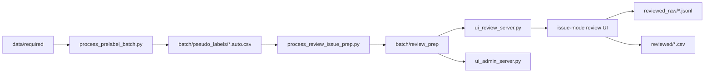

# Data Annotation Pipeline

本仓库当前已经不只是“逐帧双人框标注工具”，而是一套围绕 **AI 预标注 + issue-mode 轨迹级复核 + 风险分层 QA** 的完整标注流程。

当前统一代码目录是：

- `./codes/`

当前正式批次是：

- `./annotation/batch_20260413_v01`

---

## 当前状态

截至当前版本，主线能力如下：

1. A 阶段：预标注批处理可从 `data/required/` 生成 `pseudo_labels/*.auto.csv`
2. B 阶段：review/admin 服务可稳定加载正式 batch，并支持 issue-mode 复核
3. X 主线：轨迹级 review 已打通首版
   - issue list / timeline
   - issue 内导航
   - 整段 / 半段应用
   - 关键帧智能传播
   - 轨迹工作台
   - `split / merge / reappear / occluded / outside` 首版
4. R5 首版：离线 `review_prep` 已支持红/黄/绿风险分层、green `auto_pass`、green `qa_sample`
5. admin 面板已能显示：
   - 红 / 黄 / 绿段数量
   - `auto_pass_span_count`
   - `qa_sample_span_count`

更细的执行状态见：

- [REQUIREMENTS_TRAJECTORY_REVIEW.md](/home/hrli/data_annotation/docs/REQUIREMENTS_TRAJECTORY_REVIEW.md)

算法和流程详解见：

- [ISSUE_TRAJECTORY_REVIEW_FLOW.md](/home/hrli/data_annotation/docs/ISSUE_TRAJECTORY_REVIEW_FLOW.md)

---

## 核心目录

```text
.
├── codes/
│   ├── process_prelabel_batch.py
│   ├── process_review_issue_prep.py
│   ├── review_propagation.py
│   ├── ui_review_server.py
│   ├── ui_admin_server.py
│   ├── ui_review_web/
│   ├── ui_admin_web/
│   └── test_*.py
├── docs/
├── data/
├── annotation/
│   └── batch_<YYYYMMDD>_<vNN>/
└── staging/
```

---

## 先看哪几份文档

如果你是第一次接手，推荐顺序：

1. [README.md](/home/hrli/data_annotation/docs/README.md)
2. [REQUIREMENTS_TRAJECTORY_REVIEW.md](/home/hrli/data_annotation/docs/REQUIREMENTS_TRAJECTORY_REVIEW.md)
3. [ISSUE_TRAJECTORY_REVIEW_FLOW.md](/home/hrli/data_annotation/docs/ISSUE_TRAJECTORY_REVIEW_FLOW.md)
4. [ANNOTATOR_INTRO.md](/home/hrli/data_annotation/docs/ANNOTATOR_INTRO.md)
5. [REQUIREMENTS_PRELABEL.md](/home/hrli/data_annotation/docs/REQUIREMENTS_PRELABEL.md)
6. [REQUIREMENTS_UI_REVIEW.md](/home/hrli/data_annotation/docs/REQUIREMENTS_UI_REVIEW.md)

如果你只关心标注界面怎么用：

1. [ANNOTATOR_INTRO.md](/home/hrli/data_annotation/docs/ANNOTATOR_INTRO.md)
2. [ISSUE_TRAJECTORY_REVIEW_FLOW.md](/home/hrli/data_annotation/docs/ISSUE_TRAJECTORY_REVIEW_FLOW.md)

---

## 当前推荐流程



### 这条主线里每一步的角色

- `process_prelabel_batch.py`
  - 负责 A 阶段 AI 预标注
- `process_review_issue_prep.py`
  - 负责离线生成：
    - `track_summary.json`
    - `risk_spans.json`
    - `issue_pool.csv`
    - `review_prep_summary.json`
- `ui_review_server.py`
  - 负责在线派单、issue detail、提交、传播与导出
- `ui_admin_server.py`
  - 负责看全局统计、annotator 活跃度和风险分层

---

## 常用命令

### 1. 运行离线 review prep

```bash
cd /home/hrli/data_annotation
PYTHONPATH=codes .venv/bin/python codes/process_review_issue_prep.py \
  --batch-dir ./annotation/batch_20260413_v01
```

### 2. 启动 review 服务

```bash
cd /home/hrli/data_annotation
PYTHONPATH=codes .venv/bin/python codes/ui_review_server.py \
  --batch-dir ./annotation/batch_20260413_v01 \
  --host 127.0.0.1 \
  --port 10086
```

访问：

- `http://127.0.0.1:10086`

### 3. 启动 admin 服务

```bash
cd /home/hrli/data_annotation
PYTHONPATH=codes .venv/bin/python codes/ui_admin_server.py \
  --batch-dir ./annotation/batch_20260413_v01 \
  --host 127.0.0.1 \
  --port 10087
```

访问：

- `http://127.0.0.1:10087`

### 4. 跑当前核心测试

```bash
cd /home/hrli/data_annotation
PYTHONPATH=codes .venv/bin/python -m unittest \
  codes.test_repo_layout \
  codes.test_ui_review_server \
  codes.test_review_propagation \
  codes.test_process_review_issue_prep
```

### 5. JS 语法检查

```bash
cd /home/hrli/data_annotation
node --check codes/ui_review_web/app.js
node --check codes/ui_admin_web/app.js
```

---

## review UI 该怎么理解

当前 review UI 的默认心智模型不是：

- “给我下一帧”

而是：

- “给我下一段值得看的问题轨迹”

也就是说，默认工作单位已经从：

- 单帧

变成：

- issue
- 关键帧
- 轨迹区间

推荐用法是：

1. 点 `下一问题点`
2. 看 issue 摘要和轨迹工作台
3. 修 1 到几个关键帧
4. 用 `智能传播整段`
5. 再进入下一条 issue

详见：

- [ANNOTATOR_INTRO.md](/home/hrli/data_annotation/docs/ANNOTATOR_INTRO.md)

---

## 现在的风险分层

离线 `review_prep` 当前会把区间分成：

- `red`
  - 明显高风险，人工重点处理
- `yellow`
  - 中风险，仍进入 issue review
- `green`
  - 稳定段，默认 `auto_pass`
  - 少量抽样进入 `qa_sample`

注意：

- `green` 不等于“被证明正确”
- 它只表示“没触发当前启发式风险规则”

这也是为什么必须保留：

- `qa_sample`
- admin 风险统计

---

## 现阶段最重要的现实限制

当前系统已经可用，但还不是终态。最值得知道的限制有：

1. green 稳定段仍可能“稳定地错”
2. 完全漏检帧的表达能力还不够强
3. `submit_issue` 单帧提交仍可能过早结束整个 issue
4. 当前没有真正的 issue 加锁派单
5. `issue_id` 仍是排序编号，不是稳定主键
6. 智能传播仍然比较依赖 AI 轨迹质量

更细说明见：

- [ISSUE_TRAJECTORY_REVIEW_FLOW.md](/home/hrli/data_annotation/docs/ISSUE_TRAJECTORY_REVIEW_FLOW.md)

---

## 其他文档

- [REQUIREMENTS_PRELABEL.md](/home/hrli/data_annotation/docs/REQUIREMENTS_PRELABEL.md)
- [REQUIREMENTS_UI_REVIEW.md](/home/hrli/data_annotation/docs/REQUIREMENTS_UI_REVIEW.md)
- [REQUIREMENTS_IMU_MAPPING.md](/home/hrli/data_annotation/docs/REQUIREMENTS_IMU_MAPPING.md)
- [REQUIREMENTS_TRACK_RECOMMENDATION.md](/home/hrli/data_annotation/docs/REQUIREMENTS_TRACK_RECOMMENDATION.md)
- [REQUIREMENTS_ANNOTATION_ANALYSIS.md](/home/hrli/data_annotation/docs/REQUIREMENTS_ANNOTATION_ANALYSIS.md)
- [REQUIREMENTS_REVIEW_ANNOTATION_RESULTS.md](/home/hrli/data_annotation/docs/REQUIREMENTS_REVIEW_ANNOTATION_RESULTS.md)
- [REQUIREMENTS_FINAL_ANNOTATION.md](/home/hrli/data_annotation/docs/REQUIREMENTS_FINAL_ANNOTATION.md)
- [REQUIREMENTS.md](/home/hrli/data_annotation/docs/REQUIREMENTS.md)
