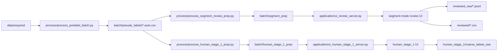

# Data Annotation Pipeline

本仓库当前已经不只是“逐帧双人框标注工具”，而是一套围绕 **AI 预标注 + 段模式复核 + 逐帧 `p1-p7` 结果生成** 的标注流程。

当前统一代码目录是：

- `./codes/`
- 当前代码分区说明见：
  - [codes/README.md](/home/hrli/data_annotation/codes/README.md)

当前正式 batch 基线是：

- `./annotation/batch_20260413_v01`
- 当前批次的段级压缩统计报告见：
  - [BATCH_20260413_V01_SEGMENT_SUMMARY.md](/home/hrli/data_annotation/docs/BATCH_20260413_V01_SEGMENT_SUMMARY.md)
- 当前推荐用于试运行最新 `human_stage_1` 行为与降本策略的派生 batch：
  - `./annotation/batch_20260417_v01`
  - 统计报告见：
    - [BATCH_20260417_V01_SEGMENT_SUMMARY.md](/home/hrli/data_annotation/docs/BATCH_20260417_V01_SEGMENT_SUMMARY.md)

---

## 当前状态

截至当前版本，主线能力如下：

1. A 阶段：预标注批处理可从 `data/required/` 生成 `pseudo_labels/*.auto.csv`
2. B/Y 阶段：review 服务已切到段模式，并已支持 `repair_window`
3. 离线主线已新增：
   - `codes/process/process_segment_review_prep.py`
   - `segment_prep/*.segments.json`
   - `segment_prep/*.segment_frames.json`
   - `segment_prep/segment_prep_summary.json`
   - `codes/process/README.md`
4. review 在线工作单元当前包括：
   - `stable_segment`
   - `non_simple_single_frame`
   - `repair_window`
5. 数学定义文档与段模式需求文档已建立
6. 已新增独立的一轮粗标主线：
   - `codes/process/process_human_stage_1_prep.py`
   - `annotation/batch_*/human_stage_1_prep/`
   - `codes/application/ui_human_stage_1_server.py`
   - `codes/application/ui_human_stage_1_web/`
7. `human_stage_1` 当前已落地的交互包括：
   - first-pass 之后的 second-pass `repair_window` 合并
   - 单帧 coarse decision：`ai_match / absent / needs_manual`
   - 同视频历史多数票推荐与自动预选
   - 批量“其余设为不存在”
   - 左侧可折叠历史栏与已提交记录修改

当前事实文档请优先看：

- [DOCUMENTATION_STATUS.md](/home/hrli/data_annotation/docs/DOCUMENTATION_STATUS.md)
- [REQUIREMENTS_SEGMENT_REVIEW.md](/home/hrli/data_annotation/docs/REQUIREMENTS_SEGMENT_REVIEW.md)
- [STABLE_SEGMENT_MATHEMATICAL_DEFINITIONS.md](/home/hrli/data_annotation/docs/STABLE_SEGMENT_MATHEMATICAL_DEFINITIONS.md)
- [REQUIREMENTS_UI_REVIEW.md](/home/hrli/data_annotation/docs/REQUIREMENTS_UI_REVIEW.md)
- [BATCH_20260417_V01_HUMAN_STAGE_1_SEGMENTATION_OPTIMIZATION_REPORT.md](/home/hrli/data_annotation/docs/BATCH_20260417_V01_HUMAN_STAGE_1_SEGMENTATION_OPTIMIZATION_REPORT.md)

历史与已归档文档入口见：

- [archive/README.md](/home/hrli/data_annotation/docs/archive/README.md)

---

## 核心目录

```text
.
├── codes/
│   ├── application/
│   ├── process/
│   ├── test/
│   └── archive/
├── docs/
├── data/
├── annotation/
│   └── batch_<YYYYMMDD>_<vNN>/
└── staging/
```

---

## 先看哪几份文档

如果你是第一次接手，推荐顺序：

1. [README.md](/home/hrli/data_annotation/docs/README.md)
2. [DOCUMENTATION_STATUS.md](/home/hrli/data_annotation/docs/DOCUMENTATION_STATUS.md)
3. [REQUIREMENTS_SEGMENT_REVIEW.md](/home/hrli/data_annotation/docs/REQUIREMENTS_SEGMENT_REVIEW.md)
4. [STABLE_SEGMENT_MATHEMATICAL_DEFINITIONS.md](/home/hrli/data_annotation/docs/STABLE_SEGMENT_MATHEMATICAL_DEFINITIONS.md)
5. [REQUIREMENTS_UI_REVIEW.md](/home/hrli/data_annotation/docs/REQUIREMENTS_UI_REVIEW.md)
6. [ANNOTATOR_INTRO.md](/home/hrli/data_annotation/docs/ANNOTATOR_INTRO.md)
7. [BATCH_20260417_V01_HUMAN_STAGE_1_SEGMENTATION_OPTIMIZATION_REPORT.md](/home/hrli/data_annotation/docs/BATCH_20260417_V01_HUMAN_STAGE_1_SEGMENTATION_OPTIMIZATION_REPORT.md)
8. [REQUIREMENTS_PRELABEL.md](/home/hrli/data_annotation/docs/REQUIREMENTS_PRELABEL.md)
9. [codes/README.md](/home/hrli/data_annotation/codes/README.md)
10. [codes/process/README.md](/home/hrli/data_annotation/codes/process/README.md)

如果你只关心 review 标注界面怎么用：

1. [ANNOTATOR_INTRO.md](/home/hrli/data_annotation/docs/ANNOTATOR_INTRO.md)
2. [REQUIREMENTS_SEGMENT_REVIEW.md](/home/hrli/data_annotation/docs/REQUIREMENTS_SEGMENT_REVIEW.md)

如果你只关心 `human_stage_1` 当前优化方向：

1. [BATCH_20260417_V01_HUMAN_STAGE_1_SEGMENTATION_OPTIMIZATION_REPORT.md](/home/hrli/data_annotation/docs/BATCH_20260417_V01_HUMAN_STAGE_1_SEGMENTATION_OPTIMIZATION_REPORT.md)
2. [codes/process/README.md](/home/hrli/data_annotation/codes/process/README.md)

---

## 当前推荐流程



### 这条主线里每一步的角色

- `process/process_prelabel_batch.py`
  - 负责 A 阶段 AI 预标注
- `process/process_segment_review_prep.py`
  - 负责离线生成：
    - `segments.json`
    - `segment_frames.json`
    - `segment_prep_summary.json`
- `application/ui_review_server.py`
  - 负责在线段级派单、代表帧加载、提交与逐帧展开
- `process/process_human_stage_1_prep.py`
  - 负责离线生成：
    - `human_stage_1_prep/*.segments.json`
    - `human_stage_1_prep/*.segment_frames.json`
    - `human_stage_1_prep/human_stage_1_prep_summary.json`
- `application/ui_human_stage_1_server.py`
  - 负责在线第一轮粗标派单、历史推荐、coarse decision 提交与修改
- `application/ui_admin_server.py`
  - 负责看全局统计与 annotator 活跃度
- `process/README.md`
  - 负责说明整个处理流程先后顺序

---

## 常用命令

### 1. 运行离线 segment prep

```bash
cd /home/hrli/data_annotation
PYTHONPATH=codes .venv/bin/python codes/process/process_segment_review_prep.py \
  --batch-dir ./annotation/batch_20260413_v01
```

### 2. 运行离线 human_stage_1 prep

```bash
cd /home/hrli/data_annotation
PYTHONPATH=codes .venv/bin/python codes/process/process_human_stage_1_prep.py \
  --batch-dir ./annotation/batch_20260417_v01
```

### 3. 启动 human_stage_1 服务

下面的 `10086` 是当前仓库常用的本地映射端口，不是 `ui_human_stage_1_server.py` 里的 argparse 默认端口。

```bash
cd /home/hrli/data_annotation
PYTHONPATH=codes .venv/bin/python codes/application/ui_human_stage_1_server.py \
  --batch-dir ./annotation/batch_20260417_v01 \
  --host 127.0.0.1 \
  --port 10086
```

访问：

- `http://127.0.0.1:10086`

### 4. 启动 review 服务

`ui_review_server.py` 的代码默认端口仍然是 `10086`，但如果本地已经把 `10086` 留给 `human_stage_1`，推荐像下面这样改在 `10088` 启动。

```bash
cd /home/hrli/data_annotation
PYTHONPATH=codes .venv/bin/python codes/application/ui_review_server.py \
  --batch-dir ./annotation/batch_20260413_v01 \
  --host 127.0.0.1 \
  --port 10088
```

访问：

- `http://127.0.0.1:10088`

### 5. 启动 admin 服务

```bash
cd /home/hrli/data_annotation
PYTHONPATH=codes .venv/bin/python codes/application/ui_admin_server.py \
  --batch-dir ./annotation/batch_20260413_v01 \
  --host 127.0.0.1 \
  --port 10087
```

访问：

- `http://127.0.0.1:10087`

### 6. 跑当前核心测试

```bash
cd /home/hrli/data_annotation
PYTHONPATH=codes .venv/bin/python -m unittest discover -s codes/test
```

### 7. JS 语法检查

```bash
cd /home/hrli/data_annotation
node --check codes/application/ui_human_stage_1_web/app.js
node --check codes/application/ui_review_web/app.js
node --check codes/application/ui_admin_web/app.js
```

---

## review UI 该怎么理解

当前 review UI 的默认心智模型不是：

- “给我下一段的一张代表图”

而是：

- “给我下一段待标注的小段”

也就是说，默认工作单位已经从：

- 逐帧随机图片

变成：

- `stable_segment`
- `non_simple_single_frame`
- `repair_window`

推荐用法是：

1. 点 `下一段`
2. 在代表图上直接标图片
3. 提交并进入下一段

详见：

- [ANNOTATOR_INTRO.md](/home/hrli/data_annotation/docs/ANNOTATOR_INTRO.md)
- [REQUIREMENTS_SEGMENT_REVIEW.md](/home/hrli/data_annotation/docs/REQUIREMENTS_SEGMENT_REVIEW.md)

## human_stage_1 UI 该怎么理解

`human_stage_1` 不是最终 bbox 标注界面，而是第一轮粗标分流界面。

它当前的心智模型是：

- 上面一排 `P1-P7` 槽位按钮
- 下面只编辑当前槽位
- 每个槽位只允许：
  - `ai_match`
  - `absent`
  - `needs_manual`

当前已经实现的辅助交互包括：

1. 同视频历史多数票推荐，并在当前帧自动预选
2. “其余设为不存在”按钮，只批量填 `absent`，不自动提交
3. 左侧可折叠历史栏，可查看并修改自己已提交的 coarse decision
4. AI 框三种视觉状态：
   - 当前选中的已匹配框：橙色高亮
   - 已匹配但当前没选中的框：实线
   - 只有 track、尚未匹配到 pid 的框：深色虚线

对外部部署来说，本地常见访问地址是：

- 本地：`http://127.0.0.1:10086`

如果需要外部转发，请以当前部署时的 ngrok 或反向代理配置为准，不要默认依赖旧的固定 URL。

---

## 现阶段最重要的现实限制

当前系统已经可用，但还不是终态。最值得知道的限制有：

1. 段模式已建立，但主服务仍处于持续收口期
2. 稳定段定义当前只吸收了 `low_score + overlap + track-set constancy`
3. `bbox_jump` 等旧风险信号还没有进入新的数学定义主线
4. 文档主线已切到段模式，但 archive 中仍保留旧阶段上下文

---

## 其他文档

- [REQUIREMENTS_SEGMENT_REVIEW.md](/home/hrli/data_annotation/docs/REQUIREMENTS_SEGMENT_REVIEW.md)
- [STABLE_SEGMENT_MATHEMATICAL_DEFINITIONS.md](/home/hrli/data_annotation/docs/STABLE_SEGMENT_MATHEMATICAL_DEFINITIONS.md)
- [codes/README.md](/home/hrli/data_annotation/codes/README.md)
- [codes/process/README.md](/home/hrli/data_annotation/codes/process/README.md)
- [REQUIREMENTS_PRELABEL.md](/home/hrli/data_annotation/docs/REQUIREMENTS_PRELABEL.md)
- [REQUIREMENTS_UI_REVIEW.md](/home/hrli/data_annotation/docs/REQUIREMENTS_UI_REVIEW.md)
- [REQUIREMENTS_IMU_MAPPING.md](/home/hrli/data_annotation/docs/REQUIREMENTS_IMU_MAPPING.md)
- [DOCUMENTATION_STATUS.md](/home/hrli/data_annotation/docs/DOCUMENTATION_STATUS.md)
- [archive/legacy_downstream/](/home/hrli/data_annotation/docs/archive/legacy_downstream)
- [archive/historical_reports/](/home/hrli/data_annotation/docs/archive/historical_reports)
- [REQUIREMENTS.md](/home/hrli/data_annotation/docs/REQUIREMENTS.md)
- [BATCH_20260413_V01_SEGMENT_SUMMARY.md](/home/hrli/data_annotation/docs/BATCH_20260413_V01_SEGMENT_SUMMARY.md)
- [BATCH_20260417_V01_SEGMENT_SUMMARY.md](/home/hrli/data_annotation/docs/BATCH_20260417_V01_SEGMENT_SUMMARY.md)
